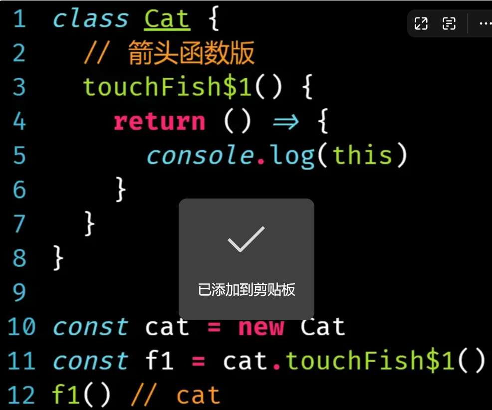
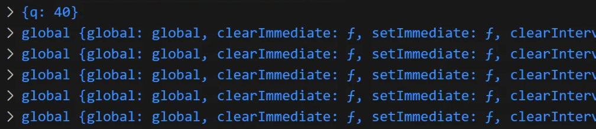

## 数据类型与typeof 并非一一对应
- null的结果是object（设计缺陷）
- object的结果是object和function

## 作用域

定义：**变量与函数的可访问范围**

分为：1.全局作用域 2.函数作用域 3.块级作用域

作用域链：当前作用域没有查到值，进而向上级作用域查找，直到查到全局作用域，这一查找过程形成的链条，就叫作用域链。

JavaScript采用的作用域规则是**词法作用域**（静态作用域），**其作用域是由书写时所在位置决定的**，而不是调用位置。在JS中有一个常用的小东西就是因为词法作用域才得以实现的,即闭包。

## 闭包
在一个函数的环境中，闭包 = 函数+词法环境（定义函数的环境）。

函数本身是个对象，这个对象关联到了另一个环境对象，这个现象就叫做闭包。

```javascript
function m(){
  var a = 1
  function sub(){
    console.log(a)
  }
}
```

### 内存泄露、垃圾回收
 
####  定义

https://v.douyin.com/fbJX3ESHrEc/ 

内存泄露的含义:**有垃圾，没有被回收**。

  - 什么叫垃圾？**你不用的，就叫东西**。

不要以为，一个东西占的大了，就叫垃圾，跟大小没关系。

那怎么判断用不用呢，就取决于你了。

假设你定义了一个数组，你把这个数组求和了，将结果赋给一个变量。好，代码执行到这，这个数组是不是就没用了？这要取决于你，如果你还需要用他，它就不算垃圾。

那么有垃圾，就会有回收？现在很多高级语言，它都有垃圾回收机制，自动的发现你程序里的垃圾并回收掉？

那么问题来，它怎么知道哪些是垃圾，一个程序，他是怎么知道你哪些东西是用不了的。答案是 **它不知道**。

但是这个垃圾回收器，它有这么一个理念：虽然它不知道有些东西你用不用，但是它认为有一个东西，你将来一定不用，就是你 **自己都不可能访问到的东西**，垃圾回收器回收的是 你想用都用不了的东西。

那具体它是怎么发现这些内存的，那有很多算法，比如说，像什么 引用计数、标记清楚、什么新生代、老生代...

但还是会残留一些，这些你明明已经不用了，但是你还能访问到的内存，这就叫做 内存泄露。

### 闭包与内存泄露

假如说，你在一个函数中定义了一个increase函数，并将这个increase函数返回。

此时这个increase函数就跟它这个环境关联了，也就是意味着，这个函数它本身会占用内存，但占用的不多，但这个函数所在的环境占用内存很大。

闭包和内存泄露其实没有直接关系，那为什么我们经常把闭包跟内存泄露关联起来呢。是因为，我们容易掉以轻心：一个函数占不了多少内存，有的时候我们觉得一个函数没有被回收掉无所谓，但是我们就忽略了这个函数它是拖家带口的，函数没被回收，就导致其关联的环境对象也回收不掉，举例一下：

假如我点击按钮，两秒后移除increase函数，假设我们将来也不用这个函数了，两秒后这个事件也被移除掉了，那么请问两秒后他是不是垃圾，那这个函数浏览器能不能回收？-> 不能。

所以这里总结一下，闭包导致内存泄露的场景：
1. 有本该被回收的函数没有回收，从而导致其关联的词法环境也无法被回收，最终导致内存泄露，当然解决办法也很简单，如果说你真的不用了，那你就手动将变量的引用置空null。那它就变成垃圾了，通过这个标记清除法就会被回收掉。
2. 当多个函数共享一个词法环境的时候，可能会造成词法环境的膨胀，从而导致出现无法访问且无法回收的内存空间
   
   

  这里increase函数没有用到词法环境的任何东西，temp函数用到了。这两个函数，他们用到的是同一个词法环境，此时词法环境里就会包含doms（占内存），但是这个函数本身返回的是increase，那这个函数运行完成之后。此时的这个temp函数肯定就是个垃圾，因为再也无法访问到了，但是这个词法环境不能销毁啊，因为increase不是垃圾啊，increase还要用啊，但是词法环境里就保存了doms，那为什么不顺带把doms也销毁掉呢？我不造，反正就是这个现象。

  也就是说，现在存在了一个现象，存在了一个我既没办法访问到，但是依然无法被回收的一种情况。那这种情况怎么处理呢：
  - 如果说将来increase函数不用了，那你就清空
  - 在闭包场景下尽量避免多个函数去共享词法环境的情况

## 执行栈与执行上下文

### 预编译

在 JavaScript 中，​预编译（Precompilation）​​ 指的是在代码执行之前，JavaScript 引擎对代码进行的一些预处理操作，主要包括 ​变量提升（Hoisting）​​ 和 ​函数提升。这个过程发生在代码执行前的 ​编译阶段​（虽然 JavaScript 是解释型语言，但现代引擎会先进行编译优化）。

在 JavaScript 代码执行前，引擎会做以下事情：

1. ​创建执行上下文（Execution Context）​​（全局、函数、eval）。
2. ​变量和函数声明提升​（Hoisting）。
3. ​确定作用域链（Scope Chain）​。
4. ​确定 this 的指向。

#### 变量提升

- 变量声明（var）会被提升到当前作用域的顶部，但 ​赋值不会提升。let 和 const 虽然也有“提升”，但会进入 ​暂时性死区（Temporal Dead Zone, TDZ）​，访问会报错。

#### 函数提升

函数声明（function）会被整体提升，而函数表达式（var fn = function() {}）只会提升变量声明。

#### 预编译的步骤--以函数为例

当函数执行时，会进行以下操作：

1. ​创建 AO（Activation Object，活动对象）​​（即函数执行上下文）。
2. ​查找形参和变量声明，作为 AO 的属性（初始值 undefined）​。
3. ​将实参赋值给形参。
4. ​查找函数声明，并覆盖同名变量​（函数优先级高于变量）。

#### 全局作用域的预编译
全局上下文（GO / Global Object）的预编译类似，但没有形参：

1. ​查找变量声明​（var），提升并赋值为 undefined。
2. ​查找函数声明，直接赋值。
   
​函数声明 > 变量声明​（同名时函数覆盖变量）

### 执行栈


## 函数中的this指向

### 基本知识
我们讨论的this指向是指的函数中的this指向，如果说不在函数中，那就看环境了，浏览器是window，node是一个空对象。

函数中的this指向，完全取决于是如何调用这个函数的。

要想完全理解this指向，需要理解执行上下文，事实就是，在创建这个执行上下文的时候，来确定这个函数的this指向。执行上下文，肯定是执行的时候创建的，所以说，this指向是调用函数的时候才确定下来的。

1. 通过new来调用（构造函数），指向新对象
2. 直接调用，指向全局对象：node环境中是一个global(但是全局变量不会放到global上)，浏览器环境中是window
3. 通过对象调用，指向调用的那个对象
4. 通过bind/call/apply来调用，指向call/apply方法的第一个参数

**箭头函数压根没有this**：由于箭头函数没有this，那么会基于闭包，就会从外层去找这个this，而由于闭包是属于词法作用域的，词法作用域是在编译时就确定了的，（JS没有编译，只有预编译），因此它不用等到这个函数真正执行的时候才能确定，这就是为什么箭头函数的this指向谁，取决于这个箭头函数的的定义位置，而不是运行位置。

### 严格模式
如何开启？
1. 使用 'use strict' 字符串指令显式开启严格模式
2.  ES6 类里，类的方法（包括构造函数）会自动处于严格模式
3.  诸如 export/import 和 ```<script type=module></script>``` 等 ESM 模块语法也会隐式开启严格模式。
   
严格模式主要是让**原本普通函数调用**和**原本普通函数调用**里指向 window 的 this 变成了 undefined，但在构造函数、对象方法调用等场景下，this 的指向规则没有因为严格模式而改变。




### 计时器回调中的this

超时调用的代码都是在**全局作用域**中执行的：
1. 非严格模式下指向window对象
2. 在严格模式下是undefined。

有时我们会遇到两个this的情况，如下，一个是setTimeout调用环境中的this，一个是延迟执行函数中的this，这个时候需要注意区别，可以理解为，setTimeout中的第一个参数就是一个单纯的函数的引用而已，它的指向跟我们一般的函数调用时一样取决于被调用时所处的环境。

```javascript
let obj = {
  say : function () {
   console.log(this);  //延迟执行函数中的this
  },
  print :　function () {
   setTimeout(this.say,0); //setTimeout调用环境中的this，指向调用者即obj
  }
  }; 
  obj.print() //setTimeout: window
```


```javascript
let obj = {
      say : function () {
            console.log(this);  //延迟执行函数中的this
        },
      print :　function () {
        setTimeout(this.say,0); //此时的this是window
    }
}; 
let func = obj.print;
func() // 直接报错，全局对象里没say这个方法呀
```

```javascript
const obj4 = {
  message: 'Hello',
  logMessage: function() {
    setTimeout(() => {
      console.log(this.message);
    }, 500);
  }
};
obj4.logMessage(); //hello
```

我们知道settimeout可以输入字符串作为函数指向，类似eval，此时的函数作用域呢

```javascript
var a = 2
function test(){
   let a = 1;
   function say(a){
      console.log(a)
   }
   setTimeout("say(a)",0)
}
test()  //say is not defined  全局环境根本没say这个函数
```
可见，当把say方法移到test内部时报错say is not defined，原因是以字符串形式执行时，javascript内部实际上调用了eval(),而eval的执行环境是全局作用域window，全局作用域没有say方法所以报错。

```javascript
var a = 2
function say() {
  console.log(a)
}
function test() {
  let a = 1;
  setTimeout("say(b)", 0)
}
test() //2
```
在执行 setTimeout("say(b)", 0) ，b也会去window作用域找，上面的代码报错

### dom事件回调中的this

1. 普通函数：dom元素
2. 箭头函数：看所在的函数作用域

### forEach中的this
1. 传入的是普通函数：foreach 中的第二个参数 是 执行 callbackFn 时用作 this 的值，如果没传，就是指向全局
2. 传入的是箭头函数：看箭头函数所在的上下文环境。


### 递归中的this
```javascript
function factorial(n) {
    console.log(this);
    if (n === 0) return 1;
    return n * factorial(n - 1);
  }
  const result6 = factorial.call({q: 40}, 5);
```


可以发现，只有第一次是call传过去的，这里其实还是涉及到执行上下文
## 如何实现一个私有属性

这里总结下所有的方法：

1. 两个下划线_ _：这种是最弱的，这是在过去没办法，根本防不住，私有属性是只能在这个类里边进行使用，下划线只是一个命名规范，是一个弱约束
2. 使用symbol
   ```javascript
   const key = Symbol('key')
   class A{
      [key] = 1;
      
      a(){
          console.log(this[key])
      }
   }

   const a = new A;
   console.log(a[key]); //1
   ```
   现在这种是外边也能用的，我们可以把上边的放到一个单独的模块里，默认只到处这个类，不导出这个符号

   ```javascript
   const key = Symbol('key')
   class A{
      [key] = 1;
      
      a(){
          console.log(this[key])
      }
   }
   export default A;
   ```

   然后在另外一个模块中去使用
   ```javascript
   import A from './A';
   const a = new A;
   ```
   但是呢，它可以使用 ```Object.getOwnPropertySymbols``` 方法得到这个实例里的所有属性，所以这个符号属于仍然能在外边获取到

   ```javascript
   import A from './A';
   const a = new A;
   const key = Object.getOwnPropertySymbols(a)[0]
   console.log(a[key])
   ```

   但是，谁会平时开发写这种代码呢，但现在是面试环境，你要尽可能的把所有的方案、情况都想到。
3. 上TS，用```private```修饰符，但是TS是一个编译时态的东西，这个私有只存在编译时态
4. 最新版的ES标准： ```# ```修饰符，语言层面的终极约束，但是只能在ES新标准上才能使用。
   ```javascript
   class A{
       #key = 1
       a(){
           console.log(this.#key)
       }
   }
   const a = new A;
   a.#key //Error: a is private and only accessible within class 'A'
   ```

5. 使用```WeakMap```或者```WeakSet```：思路就是，将类的属性名放到map中，key是这个类的this，value是私有属性所构造的对象，
   

   babel用的就是这种方式。